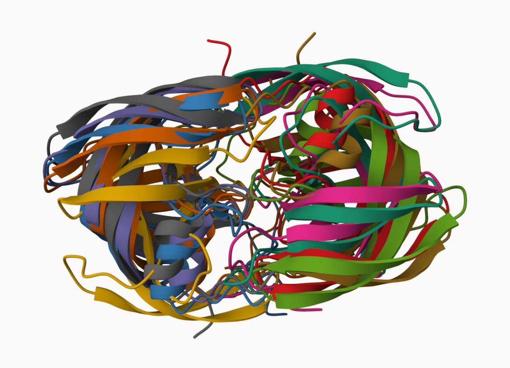
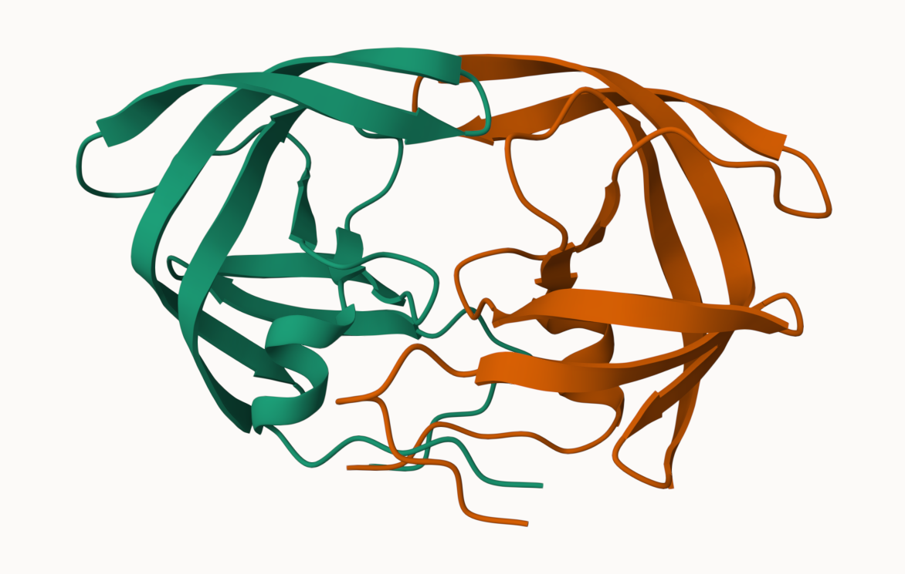
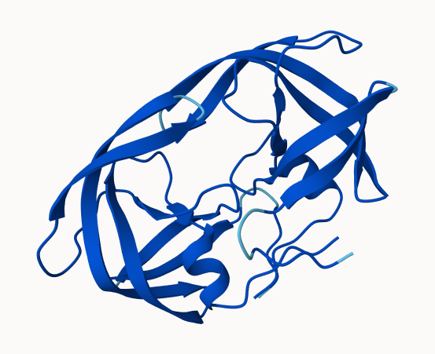
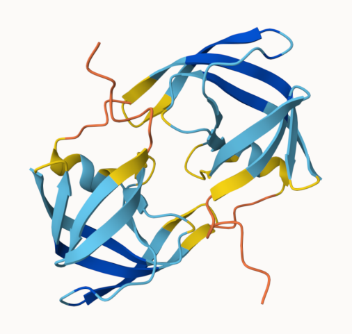

## Alpha Fold Data Bade(AFDB)

The EBI maintains the largest database of AlphaFold structure prediction models at: https://alphafold.ebi.ac.uk

From last class (before halloween) we sae that the PDB has 244,290 (Oct,2025)

The total number of protein sequences in UniProtKB is 199,579,901

> Key Point: the is a tiny fraction of sequence space that has structure coverage (0.12%)

```{r}
244290 /199579901 *100
```

AFDB is attempting to address this gap....

There are two "Quality Scores" from AlphaFold one for residues ( i.e. each amino acids) called **pLDDT** score. THe other **PAE(Predicted Aligned Error)** score measures the confidence in the relative position of two residues.

## Generating your own structure predictions

Figure of 5 generated HIV-PR Models




and the top ranked model colored by chain



plDDT score for model 1 



and model 5



# Custom analysis of reuslting models in R

Read key results files into R. The first thing I need to know is what my results directory/folder is called (i.e. it name is different for every AlphaFold run/job)

```{r}
results_dir <-"HIVPR_dimer_23119/"

pdb_files <- list.files(path=results_dir,
                        pattern="*.pdb",
                        full.names = TRUE)

# Print our PDB file names
basename(pdb_files)
```

```{r}
library(bio3d)
m1 <- read.pdb(pdb_files[1])
m1
```


```{r}
library(bio3d)
plot(m1$atom$b[m1$calpha],typ ="l")
```

```{r}
plot.bio3d(m1$atom$b[m1$calpha],typ ="l")
```


##Residue conseration form alignment file

Find the large AlphaFold alignment file


```{r}
aln_file <- list.files(path=results_dir,
                       pattern=".a3m$",
                        full.names = TRUE)
aln_file
```
 Read this in the R
```{r}
aln <- read.fasta(aln_file[1], to.upper = TRUE)
```

How many sequences are in this alignment
```{r}
dim(aln$ali)
```
 We cab score residue conservation in the alignament with the conserv()
  fucntion.
```{r}
sim <- conserv(aln)
```

```{r}
plotb3(sim[1:99],
       ylab="Conservation Score")
```

```{r}
con <- consensus(aln, cutoff = 0.9)
con$seq
```


