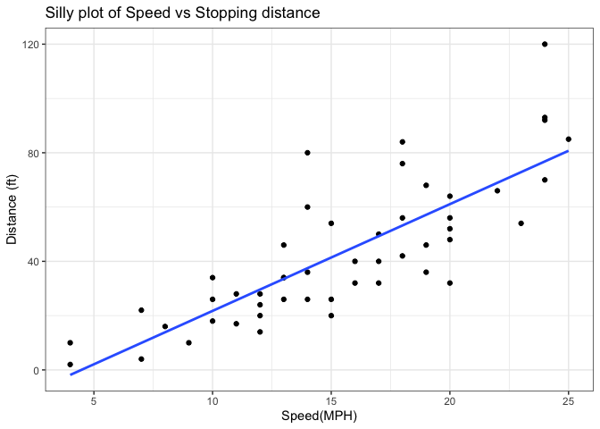
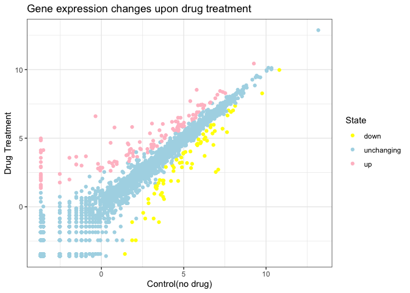
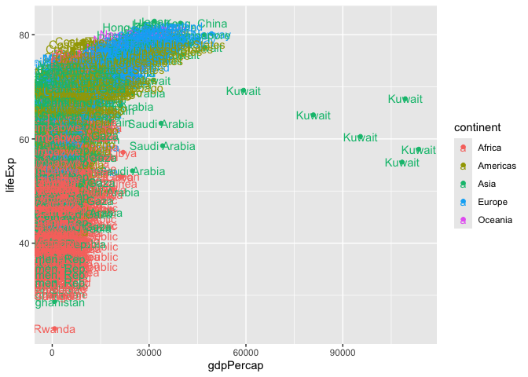

# Class5: Data Viz with ggplot
Chaewoo (A18548909)

Today we are exploring the **ggplot** package and how to make a nice
figure in R.

There are lots of ways to make figures and plot in R. These include:

- so called “base” R
- and add on packages like **ggplot2**

Here is a simple “base” R plot.

``` r
head(cars)
```

      speed dist
    1     4    2
    2     4   10
    3     7    4
    4     7   22
    5     8   16
    6     9   10

We can simply pass to the ‘plot()’ function.

``` r
plot(cars)
```


> Key-point : Base R is quick but not so nice looking in some folks eyes

Let’s see how we can plot this with **ggplot2**…

1st I need to install this add-on package. For this we use the
‘install.packages()’ function. - **WE DO THIS IN THR CONSOLE, NOT out
report**. This is a one time only deal.

2nd We need to load the package with the ‘library()’ function every time
we want to use it.

``` r
library(ggplot2)
ggplot(cars)
```


Every ggplot is composed of at least 3 layers:

- **data**(i.e a data.frame with the things you want to plot),
- aesthetics**aes()** that map the colums of data to your plot features
  (i.e aesthetics) -geoms like **geom_point()** that srt how the plot
  appears

``` r
ggplot(cars)+
  aes(x=speed, y=dist)+
  geom_point()
```


> For simple “canned” gaphs base R is quicker but as things get more
> custom and elaborate then ggplot out…

Let’s add more layers to out ggplot

Add a line showing the relationship betwen x and y Add a title Add a
custom axis labels “Speed(MPH)” and “Distance(ft)” Change the theme…

``` r
ggplot(cars)+
  aes(x=speed, y=dist)+
  geom_point() + geom_smooth(method="lm", se=FALSE)+
 labs(title="Silly plot of Speed vs Stopping distance", x ="Speed(MPH)", y="Distance (ft)") + theme_bw()
```

    `geom_smooth()` using formula = 'y ~ x'



\#Going further

Read some gene expression data

``` r
url <- "https://bioboot.github.io/bimm143_S20/class-material/up_down_expression.txt"
genes <- read.delim(url)

head(genes,5)
```

       Gene Condition1 Condition2      State
    1 A4GNT -3.6808610 -3.4401355 unchanging
    2  AAAS  4.5479580  4.3864126 unchanging
    3 AASDH  3.7190695  3.4787276 unchanging
    4  AATF  5.0784720  5.0151916 unchanging
    5  AATK  0.4711421  0.5598642 unchanging

> Q1. How many genes are in this wee dataset?

``` r
nrow(genes)
```

    [1] 5196

> Q2. How many “up” regulated genes are there?

``` r
sum( genes$State =="up")
```

    [1] 127

A useful function for counting up occurances of things in a vector is
the ‘table()’ function.

``` r
table(genes$State)
```


          down unchanging         up 
            72       4997        127 

Make a v1 figure

``` r
p<- ggplot(genes) +
  aes(x= Condition1,
     y= Condition2, col= State)+ 
  geom_point() 

p
```


``` r
p+ scale_colour_manual(values = c("up" = "pink", "down" = "yellow", "unchanging" = "lightblue")) +labs(title="Gene expression changes upon drug treatment",x= "Control(no drug)" , y="Drug Treatment")+ theme_bw()
```



\##More Plotting

``` r
# File location online
url <- "https://raw.githubusercontent.com/jennybc/gapminder/master/inst/extdata/gapminder.tsv"

gapminder <- read.delim(url)
```

Lets have a wee peak

``` r
head(gapminder, 3) 
```

          country continent year lifeExp      pop gdpPercap
    1 Afghanistan      Asia 1952  28.801  8425333  779.4453
    2 Afghanistan      Asia 1957  30.332  9240934  820.8530
    3 Afghanistan      Asia 1962  31.997 10267083  853.1007

``` r
tail(gapminder, 3)
```

          country continent year lifeExp      pop gdpPercap
    1702 Zimbabwe    Africa 1997  46.809 11404948  792.4500
    1703 Zimbabwe    Africa 2002  39.989 11926563  672.0386
    1704 Zimbabwe    Africa 2007  43.487 12311143  469.7093

> Q4. How many different county values are in this dataset?

``` r
length(table(gapminder$country))
```

    [1] 142

> Q5. How many different continet values are in this dataset.

``` r
length(table(gapminder$continent))
```

    [1] 5

``` r
unique(gapminder$continent)
```

    [1] "Asia"     "Europe"   "Africa"   "Americas" "Oceania" 

``` r
ggplot(gapminder) +
  aes(gdpPercap,lifeExp, col= continent) + 
  geom_point() 
```


``` r
ggplot(gapminder) +
  aes(gdpPercap,lifeExp, col= continent, label=country) + 
  geom_point()+
  geom_text()
```



I can use the **ggrepel** package to make more sensivle labels here.

i want a seperate pannel per continent

``` r
ggplot(gapminder) +
  aes(gdpPercap,lifeExp, col= continent, label=country) + 
  geom_point()+
  facet_wrap(~continent)
```


Layered Grammar of Graphics: ggplot2 uses a consistent, layered approach
where you build plots by adding layers for data, aesthetics, and
geometric objects. This makes complex plots easier to construct and
modify 1 , 3 , 2 . Publication-Quality Defaults: ggplot2 produces
attractive, publication-ready figures with sensible defaults, reducing
the need for manual tweaking that is often required in base R 1 , 3 , 2
. Declarative Syntax: You specify what you want to see (data mappings,
aesthetics, geoms) rather than how to draw each element, making code
more readable and maintainable 1 , 3 , 2 . Customization and
Extensibility: It is easier to customize and extend plots (e.g., adding
color, themes, labels) using a consistent syntax, whereas base R often
requires different functions and arguments for each plot type 1 , 3 , 2
. Reproducibility: ggplot2 code is scriptable and reproducible, allowing
you to recreate and share plots easily
