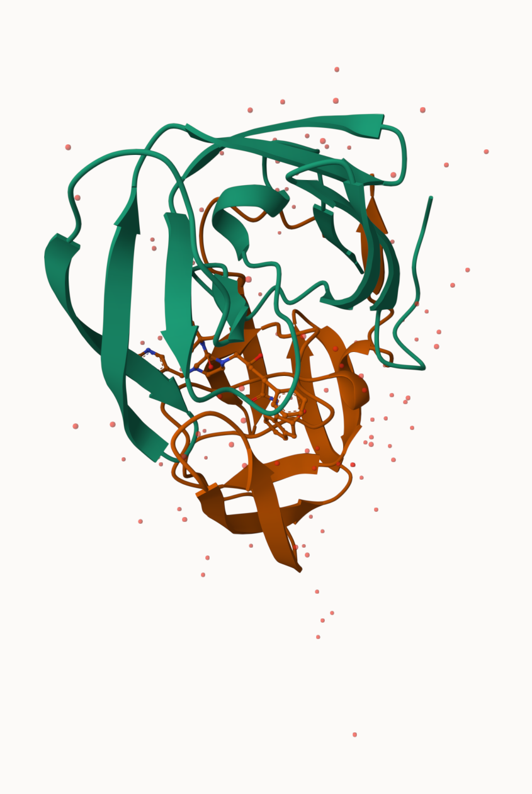
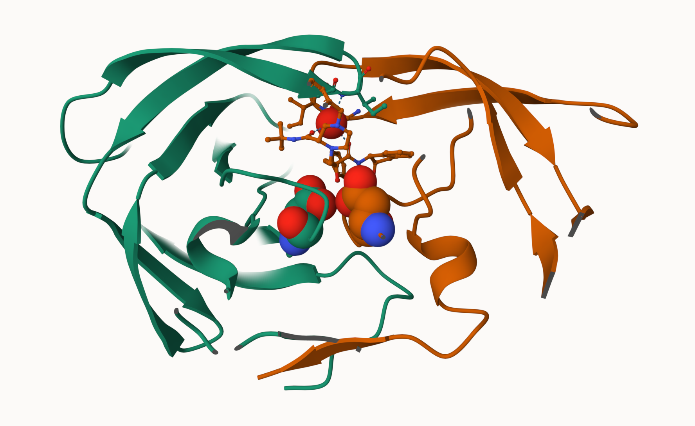

## Introduction to the RCSB Protein Data Bank (PDB)

The main database for structural biology is called the PDB (Protein Data Base). Let's have a look at what it contains:

Download The “Analyze” > “PDB Statistics” > “by Experimental Method and Molecular Type” 

```{r}
stats <-read.csv("Data Export Summary.csv")
stats
```


```{r}
as.numeric(sub(",","",stats$Total))
```
```{r pdbstats, message= FALSE}
library(readr)

stats <-read_csv("Data Export Summary.csv")
stats
```

```{r}
n.total<-sum(stats$Total)
n.total
```

>Q1: What percentage of structures in the PDB are solved by X-Ray and Electron Microscopy. Give your answers to 2 significant figures.

```{r}
n.xray <- sum(stats$ `X-ray`)
percent.xray <- n.xray /n.total *100
percent.xray
```

```{r}
n.em <- sum(stats$ `EM`)
percent.em <-n.em /n.total *100
percent.em
```

There are `r round(percent.xray,2)` percent Xray Structures in the PDB.
There are `r round(percent.em,2)` percent Xray Structures in the PDB.

>Q2: What proportion of structures in the PDB are protein?

```{r}
round(stats$Total[1]/n.total*100,2)
```

>Q3: Type HIV in the PDB website search box on the home page and determine how many HIV-1 protease structures are in the current PDB?

2,406

## Visualizing the HIV-1 protease structure

Package for structural bioinformatics

```{r}
library(bio3d)

hiv <- read.pdb("1hsg")
hiv
```

Let's first use the Mol* viewer to explore this structure.




```{r}
head(hiv$atom)
```

>Q4: Water molecules normally have 3 atoms. Why do we see just one atom per water molecule in this structure?

In most X-ray/EM PDB entries, hydrogens are not resolved/modelled. Crystallographic waters are therefore stored as a single oxygen atom (“HOH”/“WAT”). That’s why you see one sphere per water.

>Q5: There is a critical “conserved” water molecule in the binding site. Can you identify this water molecule? What residue number does this water molecule have

The conserved binding-site water that bridges Asp25/Asp25′ and the ligand is **HOH 301** (report the exact number you see in Mol*).

>Q6: Generate and save a figure clearly showing the two distinct chains of HIV-protease along with the ligand. You might also consider showing the catalytic residues ASP 25 in each chain and the critical water (we recommend “Ball & Stick” for these side-chains). Add this figure to your Quarto document.




Extract the sequence
```{r}
pdbseq(hiv)
```

```{r}
chainA_seq <- pdbseq(trim.pdb(hiv, chain = "A"))
```


##Introduction to Bio3D in R

```{r}
pdb <- read.pdb("1hsg")   
pdb                   
attributes(pdb)          
head(pdb$atom)            
```

>Q7: How many amino acid residues are there in this pdb object? 

198 amino-acid residues

>Q8: Name one of the two non-protein residues? 

HOH (water) — the other is MK1 (indinavir)

>Q9: How many protein chains are in this structure? 

2 protein chains (A and B)

```{r}
attributes(pdb)
```

```{r}
head(pdb$atom)
```


I can interactively view these PDB objects in R with the new  **bio3dview** package.

To install this I can setup **pak** package and use it to install **bio3dview** from GitHub. In my console I first run

install.packages("pak")
pak::pak("bioboot/bio3dview")


```{r}
library(bio3dview)

view.pdb(hiv)
```

```{r}
sel <- atom.select(hiv, resno=25)

view.pdb(hiv, highlight = sel,
         highlight.style = "spacefill",
         colorScheme ="chain",
         col =c("blue","orange"),
         backgroundColor = "pink")
```

##Predict protein flexibility

We can run a bioinformatics calculation to preduct protein dynamics- i.e. functional motions.

We will use the `nma()` function:
```{r}
adk <- read.pdb("6s36")
adk
```

```{r}
m <- nma(adk)
plot(m)
```

Generate a "trajectory" of predicted motion
```{r}
mktrj(m, file="ADK_nma.pdb")
```

```{r}
view.nma(m)
```


##Comparative structure analysis of Adenylate Kinase

install.packages("bio3d")
install.packages("BiocManager")
BiocManager::install("msa")
install.packages("ggplot2")
install.packages("ggrepel")


>Q10. Which of the packages above is found only on BioConductor and not CRAN? 

msa

>Q11. Which of the above packages is not found on BioConductor or CRAN?: 

bio3dview

>Q12. True or False? Functions from the pak package can be used to install packages from GitHub and BitBucket? 

TRUE

```{r}
library(bio3d)
aa <- get.seq("1ake_A")
aa
```

>Q13. How many amino acids are in this sequence, i.e. how long is this sequence?

214 amino acids


install.packages("BiocManager")
BiocManager::install("msa")


```{r}
hits <- NULL
hits$pdb.id <- c('1AKE_A','6S36_A','6RZE_A','3HPR_A','1E4V_A','5EJE_A','1E4Y_A','3X2S_A','6HAP_A','6HAM_A','4K46_A','3GMT_A','4PZL_A')
```

```{r}
files <- get.pdb(hits$pdb.id, path="pdbs", split=TRUE, gzip=TRUE)
```
```{r}
pdbs <- pdbaln(files, fit = TRUE, exefile="msa")
```

```{r}
ids <- basename.pdb(pdbs$id)
```


```{r}
plot(pdbs, labels = ids)
```


```{r}
# --- Annotation: add species info for each PDB ID ---
library(bio3d)

anno <- pdb.annotate(ids)      # annotate by PDB code
unique(anno$source)            # the species list shown in the handout
anno                           # view full annotation table

# keep a compact df aligned to ids
annodf <- data.frame(id = ids, species = anno$source, stringsAsFactors = FALSE)

```


```{r}
# --- PCA on the aligned/superposed ensemble ---
pc.xray <- pca(pdbs)

# Base bio3d PCA plot (PC1 vs PC2)
plot(pc.xray)

```


Function rmsd() will calculate all pairwise RMSD values of the structural ensemble. This facilitates clustering analysis based on the pairwise structural deviation:


```{r}
# --- Pairwise RMSD → clustering into 3 groups ---
rd <- rmsd(pdbs)
hc.rd <- hclust(dist(rd))
grps.rd <- cutree(hc.rd, k = 3)

# Base plot with clusters shown as filled circles
plot(pc.xray, 1:2, col = "grey50", bg = grps.rd, pch = 21, cex = 1)

```

The plot shows a conformer plot – a low-dimensional representation of the conformational variability within the ensemble of PDB structures. The plot is obtained by projecting the individual structures onto two selected PCs (e.g. PC-1 and PC-2). These projections display the inter-conformer relationship in terms of the conformational differences described by the selected PCs.

