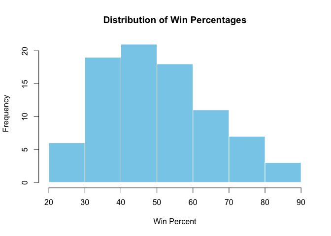
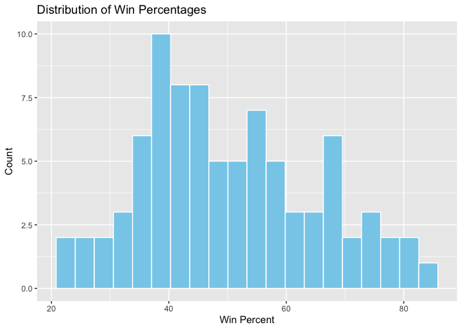
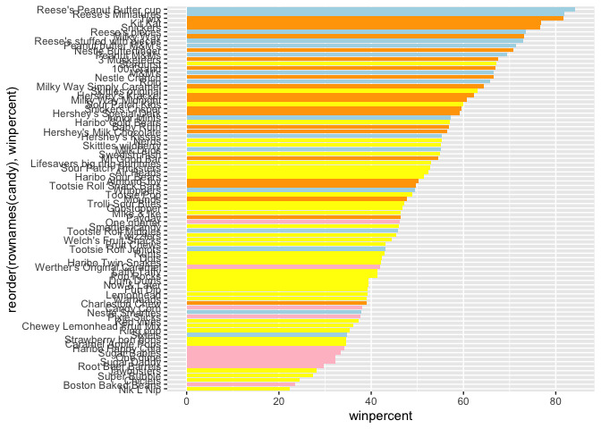
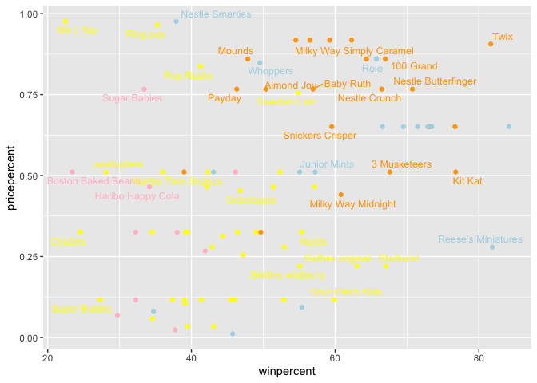
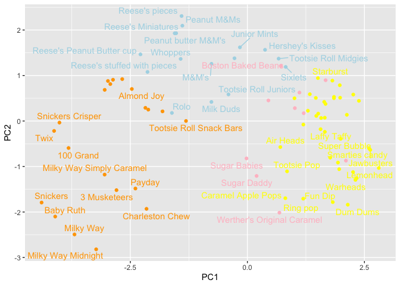

# Class 10: Halloween mini project
Chaewoo Chun (A18548909)

- [Background](#background)
- [Data Import](#data-import)
- [Quick overview of the dataset](#quick-overview-of-the-dataset)
- [Winpercent and Pricepercent](#winpercent-and-pricepercent)
- [Exploring the correlation
  structure](#exploring-the-correlation-structure)
- [Pricipal Component Analysis](#pricipal-component-analysis)

## Background

As it is nearly halloween and the half way point in the quarter let’s do
a mini project to help us figure our the best candy!

Our come from the 538 website and is available as a CSV file:

## Data Import

``` r
candy<- read.csv("candy-data.csv", row.names =1)
head(candy)
```

                 chocolate fruity caramel peanutyalmondy nougat crispedricewafer
    100 Grand            1      0       1              0      0                1
    3 Musketeers         1      0       0              0      1                0
    One dime             0      0       0              0      0                0
    One quarter          0      0       0              0      0                0
    Air Heads            0      1       0              0      0                0
    Almond Joy           1      0       0              1      0                0
                 hard bar pluribus sugarpercent pricepercent winpercent
    100 Grand       0   1        0        0.732        0.860   66.97173
    3 Musketeers    0   1        0        0.604        0.511   67.60294
    One dime        0   0        0        0.011        0.116   32.26109
    One quarter     0   0        0        0.011        0.511   46.11650
    Air Heads       0   0        0        0.906        0.511   52.34146
    Almond Joy      0   1        0        0.465        0.767   50.34755

``` r
flextable::flextable(head(candy,10))
```


> Q1. How many different candy types are in this dataset?

``` r
nrow(candy)
```

    [1] 85

there are 85 different types of candies.

``` r
candy|>
  nrow()
```

    [1] 85

``` r
 library(tidyverse)
```

    ── Attaching core tidyverse packages ──────────────────────── tidyverse 2.0.0 ──
    ✔ dplyr     1.1.4     ✔ readr     2.1.5
    ✔ forcats   1.0.1     ✔ stringr   1.5.2
    ✔ ggplot2   4.0.0     ✔ tibble    3.3.0
    ✔ lubridate 1.9.4     ✔ tidyr     1.3.1
    ✔ purrr     1.1.0     
    ── Conflicts ────────────────────────────────────────── tidyverse_conflicts() ──
    ✖ dplyr::filter() masks stats::filter()
    ✖ dplyr::lag()    masks stats::lag()
    ℹ Use the conflicted package (<http://conflicted.r-lib.org/>) to force all conflicts to become errors

``` r
candy %>%
  nrow()
```

    [1] 85

> Q2. How many fruity candy types are in the dataset?

``` r
sum(candy$fruity ==1)
```

    [1] 38

There are 38 of fruity candy in the dataset

> Q3. What is your favorite candy in the dataset and what is it’s
> winpercent value?

my favorite candy is Snickers!

``` r
candy["Snickers", ]$winpercent
```

    [1] 76.67378

There are 76.67% of Snickers

``` r
library(dplyr)

candy|> filter (rownames(candy)=="Snickers")|>
  select(winpercent)
```

             winpercent
    Snickers   76.67378

> Q4. What is the winpercent value for “Kit Kat”?

``` r
candy["Kit Kat", ]$winpercent
```

    [1] 76.7686

> Q5. What is the winpercent value for “Tootsie Roll Snack Bars”?

``` r
candy["Tootsie Roll Snack Bars", ]$winpercent
```

    [1] 49.6535

## Quick overview of the dataset

> Q6. Is there any variable/column that looks to be on a different scale
> to the majority of the other columns in the dataset?

``` r
library(skimr)
skim(candy)
```

|                                                  |       |
|:-------------------------------------------------|:------|
| Name                                             | candy |
| Number of rows                                   | 85    |
| Number of columns                                | 12    |
| \_\_\_\_\_\_\_\_\_\_\_\_\_\_\_\_\_\_\_\_\_\_\_   |       |
| Column type frequency:                           |       |
| numeric                                          | 12    |
| \_\_\_\_\_\_\_\_\_\_\_\_\_\_\_\_\_\_\_\_\_\_\_\_ |       |
| Group variables                                  | None  |

Data summary

**Variable type: numeric**

| skim_variable | n_missing | complete_rate | mean | sd | p0 | p25 | p50 | p75 | p100 | hist |
|:---|---:|---:|---:|---:|---:|---:|---:|---:|---:|:---|
| chocolate | 0 | 1 | 0.44 | 0.50 | 0.00 | 0.00 | 0.00 | 1.00 | 1.00 | ▇▁▁▁▆ |
| fruity | 0 | 1 | 0.45 | 0.50 | 0.00 | 0.00 | 0.00 | 1.00 | 1.00 | ▇▁▁▁▆ |
| caramel | 0 | 1 | 0.16 | 0.37 | 0.00 | 0.00 | 0.00 | 0.00 | 1.00 | ▇▁▁▁▂ |
| peanutyalmondy | 0 | 1 | 0.16 | 0.37 | 0.00 | 0.00 | 0.00 | 0.00 | 1.00 | ▇▁▁▁▂ |
| nougat | 0 | 1 | 0.08 | 0.28 | 0.00 | 0.00 | 0.00 | 0.00 | 1.00 | ▇▁▁▁▁ |
| crispedricewafer | 0 | 1 | 0.08 | 0.28 | 0.00 | 0.00 | 0.00 | 0.00 | 1.00 | ▇▁▁▁▁ |
| hard | 0 | 1 | 0.18 | 0.38 | 0.00 | 0.00 | 0.00 | 0.00 | 1.00 | ▇▁▁▁▂ |
| bar | 0 | 1 | 0.25 | 0.43 | 0.00 | 0.00 | 0.00 | 0.00 | 1.00 | ▇▁▁▁▂ |
| pluribus | 0 | 1 | 0.52 | 0.50 | 0.00 | 0.00 | 1.00 | 1.00 | 1.00 | ▇▁▁▁▇ |
| sugarpercent | 0 | 1 | 0.48 | 0.28 | 0.01 | 0.22 | 0.47 | 0.73 | 0.99 | ▇▇▇▇▆ |
| pricepercent | 0 | 1 | 0.47 | 0.29 | 0.01 | 0.26 | 0.47 | 0.65 | 0.98 | ▇▇▇▇▆ |
| winpercent | 0 | 1 | 50.32 | 14.71 | 22.45 | 39.14 | 47.83 | 59.86 | 84.18 | ▃▇▆▅▂ |

The winpercent is on a 0-100 scale the rest are 0-1 scale.

> Q7. What do you think a zero and one represent for the
> candy\$chocolate column?

``` r
unique(candy$chocolate)
```

    [1] 1 0

In candy\$chocolate, 1 means the candy contains chocolate, 0 means the
candy does not contain chocolate.

> Q8. Plot a histogram of winpercent values

``` r
hist(candy$winpercent,
     main = "Distribution of Win Percentages",
     xlab = "Win Percent",
     col = "skyblue", border = "white")
```



``` r
library(ggplot2)
ggplot(candy, aes(x = winpercent)) +
  geom_histogram(bins= 20, fill = "skyblue", color = "white") +
  labs(title = "Distribution of Win Percentages", x = "Win Percent", y = "Count")
```



> Q9. Is the distribution of winpercent values symmetrical?

No — the distribution is is not symmetrical

> Q10. Is the center of the distribution above or below 50%?

``` r
mean(candy$winpercent)
```

    [1] 50.31676

``` r
median(candy$winpercent)
```

    [1] 47.82975

``` r
summary(candy$winpercent)
```

       Min. 1st Qu.  Median    Mean 3rd Qu.    Max. 
      22.45   39.14   47.83   50.32   59.86   84.18 

The mean is about 50%, but the median is below 50%, so the center of the
distribution is slightly below 50%. That means most candies are less
popular than average.

> Q11. On average is chocolate candy higher or lower ranked than fruit
> candy?

On average, chocolate candies have a higher winpercent (60.9%) than
fruity candies (44.1%), meaning chocolate candies are more popular
overall.

``` r
#1. Find all chocolate candy in the dataset
#2. Find their winpercent values
#3. Calculate the mean of these values

#4-6. Do the same for fruity candy
#7. Compare mean winpercents of chocolate vs fruity
#8 Pick the highest as the winner

choc.inds <- candy$chocolate==1
choc.win <- candy[choc.inds, ]$winpercent
choc.mean <- mean(choc.win)
choc.mean
```

    [1] 60.92153

``` r
mean(candy[candy$chocolate ==1,]$winpercent)
```

    [1] 60.92153

``` r
mean(candy[candy$fruity==1,]$winpercent)
```

    [1] 44.11974

``` r
fruit.ind <- candy$fruity==1
fruit.win <- candy[fruit.ind,]$winpercent
fruit.mean <- mean(fruit.win)
fruit.mean
```

    [1] 44.11974

> Q12. Is this difference statistically significant?

``` r
t.test(choc.win,fruit.win)
```


        Welch Two Sample t-test

    data:  choc.win and fruit.win
    t = 6.2582, df = 68.882, p-value = 2.871e-08
    alternative hypothesis: true difference in means is not equal to 0
    95 percent confidence interval:
     11.44563 22.15795
    sample estimates:
    mean of x mean of y 
     60.92153  44.11974 

Chocolate candies are significantly more popular than fruity candies.
Chocolate candies have a mean winpercent of 60.9%, while fruity candies
average 44.1%. The p-value (2.87 × 10^-8) indicates a highly significant
difference. The 95% confidence interval (11.45–22.16) shows that
chocolate candies outperform fruity candies by roughly 11–22 percentage
points on average.

> Q13. What are the five least liked candy types in this set?

``` r
candy |>
  arrange(winpercent) |>
  head(5)
```

                       chocolate fruity caramel peanutyalmondy nougat
    Nik L Nip                  0      1       0              0      0
    Boston Baked Beans         0      0       0              1      0
    Chiclets                   0      1       0              0      0
    Super Bubble               0      1       0              0      0
    Jawbusters                 0      1       0              0      0
                       crispedricewafer hard bar pluribus sugarpercent pricepercent
    Nik L Nip                         0    0   0        1        0.197        0.976
    Boston Baked Beans                0    0   0        1        0.313        0.511
    Chiclets                          0    0   0        1        0.046        0.325
    Super Bubble                      0    0   0        0        0.162        0.116
    Jawbusters                        0    1   0        1        0.093        0.511
                       winpercent
    Nik L Nip            22.44534
    Boston Baked Beans   23.41782
    Chiclets             24.52499
    Super Bubble         27.30386
    Jawbusters           28.12744

``` r
x<- c(5,1,10,4)
#sort(x)
order(x)
```

    [1] 2 4 1 3

``` r
#(candy$winpercent)
```

``` r
order.ind <- order(candy$winpercent)
head(candy[order.ind,], 5)
```

                       chocolate fruity caramel peanutyalmondy nougat
    Nik L Nip                  0      1       0              0      0
    Boston Baked Beans         0      0       0              1      0
    Chiclets                   0      1       0              0      0
    Super Bubble               0      1       0              0      0
    Jawbusters                 0      1       0              0      0
                       crispedricewafer hard bar pluribus sugarpercent pricepercent
    Nik L Nip                         0    0   0        1        0.197        0.976
    Boston Baked Beans                0    0   0        1        0.313        0.511
    Chiclets                          0    0   0        1        0.046        0.325
    Super Bubble                      0    0   0        0        0.162        0.116
    Jawbusters                        0    1   0        1        0.093        0.511
                       winpercent
    Nik L Nip            22.44534
    Boston Baked Beans   23.41782
    Chiclets             24.52499
    Super Bubble         27.30386
    Jawbusters           28.12744

> Q14. What are the top 5 all time favorite candy types out of this set?

``` r
candy |>
  arrange(-winpercent) |>
  head(5)
```

                              chocolate fruity caramel peanutyalmondy nougat
    Reese's Peanut Butter cup         1      0       0              1      0
    Reese's Miniatures                1      0       0              1      0
    Twix                              1      0       1              0      0
    Kit Kat                           1      0       0              0      0
    Snickers                          1      0       1              1      1
                              crispedricewafer hard bar pluribus sugarpercent
    Reese's Peanut Butter cup                0    0   0        0        0.720
    Reese's Miniatures                       0    0   0        0        0.034
    Twix                                     1    0   1        0        0.546
    Kit Kat                                  1    0   1        0        0.313
    Snickers                                 0    0   1        0        0.546
                              pricepercent winpercent
    Reese's Peanut Butter cup        0.651   84.18029
    Reese's Miniatures               0.279   81.86626
    Twix                             0.906   81.64291
    Kit Kat                          0.511   76.76860
    Snickers                         0.651   76.67378

> Q15. Make a first barplot of candy ranking based on winpercent values.

``` r
ggplot(candy)+
  aes(winpercent, rownames(candy))+
  geom_col()
```


> Q16. This is quite ugly, use the reorder() function to get the bars
> sorted by winpercent?

``` r
ggplot(candy)+
  aes(x=winpercent, y=reorder(rownames(candy), winpercent))+
  geom_col()
```


Add some color based on the “type of candy”

``` r
my_cols <-rep("pink",nrow(candy))
my_cols[as.logical(candy$chocolate)] <- "lightblue"
my_cols[as.logical(candy$fruity)]<- "yellow"
my_cols[as.logical(candy$bar)] <- "orange"
my_cols
```

     [1] "orange"    "orange"    "pink"      "pink"      "yellow"    "orange"   
     [7] "orange"    "pink"      "pink"      "yellow"    "orange"    "yellow"   
    [13] "yellow"    "yellow"    "yellow"    "yellow"    "yellow"    "yellow"   
    [19] "yellow"    "pink"      "yellow"    "yellow"    "lightblue" "orange"   
    [25] "orange"    "orange"    "yellow"    "lightblue" "orange"    "yellow"   
    [31] "yellow"    "yellow"    "lightblue" "lightblue" "yellow"    "lightblue"
    [37] "orange"    "orange"    "orange"    "orange"    "orange"    "yellow"   
    [43] "orange"    "orange"    "yellow"    "yellow"    "orange"    "lightblue"
    [49] "pink"      "yellow"    "yellow"    "lightblue" "lightblue" "lightblue"
    [55] "lightblue" "yellow"    "lightblue" "pink"      "yellow"    "lightblue"
    [61] "yellow"    "yellow"    "lightblue" "yellow"    "orange"    "orange"   
    [67] "yellow"    "yellow"    "yellow"    "yellow"    "pink"      "pink"     
    [73] "yellow"    "yellow"    "yellow"    "lightblue" "lightblue" "orange"   
    [79] "yellow"    "orange"    "yellow"    "yellow"    "yellow"    "pink"     
    [85] "lightblue"

``` r
ggplot(candy)+
  aes(x=winpercent, y=reorder(rownames(candy), winpercent))+
  geom_col(fill= my_cols)
```



> Q17. What is the worst ranked chocolate candy?

Nik L Rip

> Q18. What is the best ranked fruity candy?

Reeses Peanut Butter cup

## Winpercent and Pricepercent

A plot with both variables/columns winpercent and pricepercent

``` r
library(ggrepel)

ggplot(candy) +
  aes(winpercent, pricepercent, label=rownames(candy)) +
  geom_point(col=my_cols) + 
  geom_text_repel(col=my_cols, size=3.3, max.overlaps = 5)
```

    Warning: ggrepel: 50 unlabeled data points (too many overlaps). Consider
    increasing max.overlaps



> Q19. Which candy type is the highest ranked in terms of winpercent for
> the least money - i.e. offers the most bang for your buck?

Reese’s Peanut Butter Cup offers the best value for money — it has one
of the highest winpercents while not being among the most expensive.

> Q20. What are the top 5 most expensive candy types in the dataset and
> of these which is the least popular?

Nik L Nip, Nestle Smarties,Ring Pop, Hershey’s Krackel, Hershey’s Milk
Chocolate are the top 5 most expensive and

Nik L Nip is the most least popular candy (22.44%)

``` r
ord <- order(candy$pricepercent, decreasing = TRUE)
head(candy[ord, c(11,12)], n=5)
```

                             pricepercent winpercent
    Nik L Nip                       0.976   22.44534
    Nestle Smarties                 0.976   37.88719
    Ring pop                        0.965   35.29076
    Hershey's Krackel               0.918   62.28448
    Hershey's Milk Chocolate        0.918   56.49050

## Exploring the correlation structure

``` r
library(corrplot)
```

    corrplot 0.95 loaded

``` r
cij <- cor(candy)
corrplot(cij)
```


> Q22. Examining this plot what two variables are anti-correlated
> (i.e. have minus values)?

chocolate and fruity — when a candy is chocolaty, it’s usually not
fruity, and vice versa. chocolate and fruity are most anti-correlated.

> Q23. Similarly, what two variables are most positively correlated?

chocolate and bar are most positively correlated.

## Pricipal Component Analysis

The function to use is called `prcomp()` with an optional `scale=T/F`
argument.

``` r
pca <- prcomp(candy, scale=TRUE)
summary(pca)
```

    Importance of components:
                              PC1    PC2    PC3     PC4    PC5     PC6     PC7
    Standard deviation     2.0788 1.1378 1.1092 1.07533 0.9518 0.81923 0.81530
    Proportion of Variance 0.3601 0.1079 0.1025 0.09636 0.0755 0.05593 0.05539
    Cumulative Proportion  0.3601 0.4680 0.5705 0.66688 0.7424 0.79830 0.85369
                               PC8     PC9    PC10    PC11    PC12
    Standard deviation     0.74530 0.67824 0.62349 0.43974 0.39760
    Proportion of Variance 0.04629 0.03833 0.03239 0.01611 0.01317
    Cumulative Proportion  0.89998 0.93832 0.97071 0.98683 1.00000

Our main PCA result figure

``` r
ggplot(pca$x)+
  aes(PC1,PC2,
      label=rownames(pca$x))+
  geom_point(col =my_cols)+
  geom_text_repel(col=my_cols,max.overlaps =7)
```

    Warning: ggrepel: 40 unlabeled data points (too many overlaps). Consider
    increasing max.overlaps



We should also examine the variable “loadings” or contributions of the
original variables to the new PCs.

``` r
 ggplot(pca$rotation)+
  aes(PC1, rownames(pca$rotation))+
  geom_col()
```


``` r
p<- ggplot(pca$x)+
  aes(PC1,PC2,
      label=rownames(pca$x))+
  geom_point(col =my_cols)+
  geom_text_repel(col=my_cols,max.overlaps =7)
```

Interactive plots that can be zoomed on and “brushed ocer an by made
with the **plotly** package. It’s output is interactive and will not
render to PDF.

``` r
library(plotly)
```


    Attaching package: 'plotly'

    The following object is masked from 'package:ggplot2':

        last_plot

    The following object is masked from 'package:stats':

        filter

    The following object is masked from 'package:graphics':

        layout

``` r
#plotly(p)
```

> Q24. What original variables are picked up strongly by PC1 in the
> positive direction? Do these make sense to you?

PC1 separates fruity/pluribus candies (positive) from chocolate/bar
candies (negative).

``` r
par(mar=c(8,4,2,2))
barplot(pca$rotation[,1], las=2, ylab="PC1 Contribution")
```


